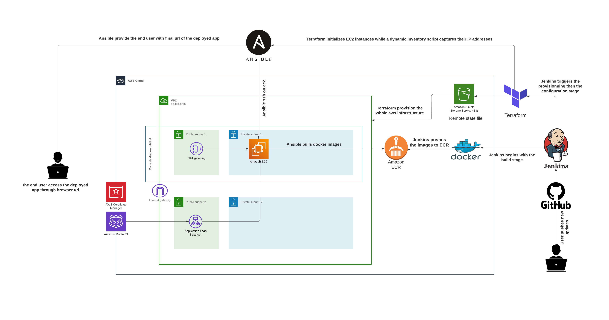

# Automated CI/CD Pipeline for 3-Tier Containerized Architecture

## Project Overview

This project implements a fully automated CI/CD pipeline designed to deploy a containerized 3-tier architecture. The solution leverages modern DevOps practices and tools to ensure consistent, reliable, and automated deployments.

## Architecture

The architecture consists of three main tiers, each containerized using Docker and orchestrated with Docker Compose. The entire infrastructure is provisioned and managed using Infrastructure as Code (IaC) principles.

## Key Features

- Fully automated CI/CD pipeline using Jenkins
- Containerized application architecture using Docker and Docker Compose
- Automated infrastructure provisioning with Terraform
- Configuration management through Ansible
- Seamless integration with GitHub for source control
- Automated deployment to AWS EC2 instances
- Container registry integration for image management

## Technical Stack

- **Containerization**: Docker, Docker Compose
- **CI/CD**: Jenkins
- **Version Control**: GitHub
- **Cloud Infrastructure**: AWS EC2
- **Infrastructure as Code**: Terraform
- **Configuration Management**: Ansible
- **Deployment**: Automated scripts

## Pipeline Flow

1. Code retrieval from GitHub repository
2. Docker image building and testing
3. Image pushing to container registry
4. Infrastructure provisioning via Terraform
5. Server configuration using Ansible
6. Application deployment to AWS EC2

## Infrastructure Management

- **Provisioning**: Terraform handles the automated creation and management of AWS EC2 instances
- **Configuration**: Ansible ensures consistent server setup and environment configuration
- **Scaling**: Infrastructure can be easily scaled up or down through IaC

## Prerequisites

- AWS Account with appropriate permissions
- Jenkins server
- Docker and Docker Compose
- Terraform installed
- Ansible installed
- GitHub account

